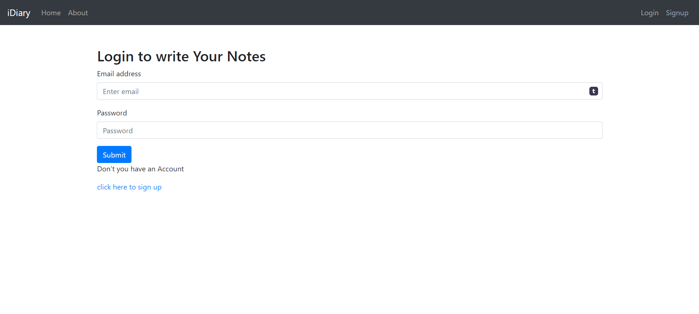
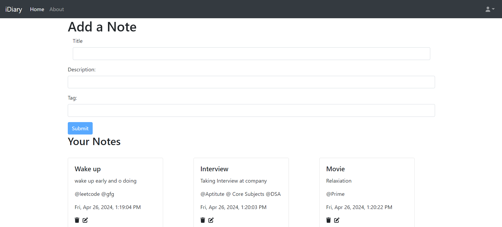
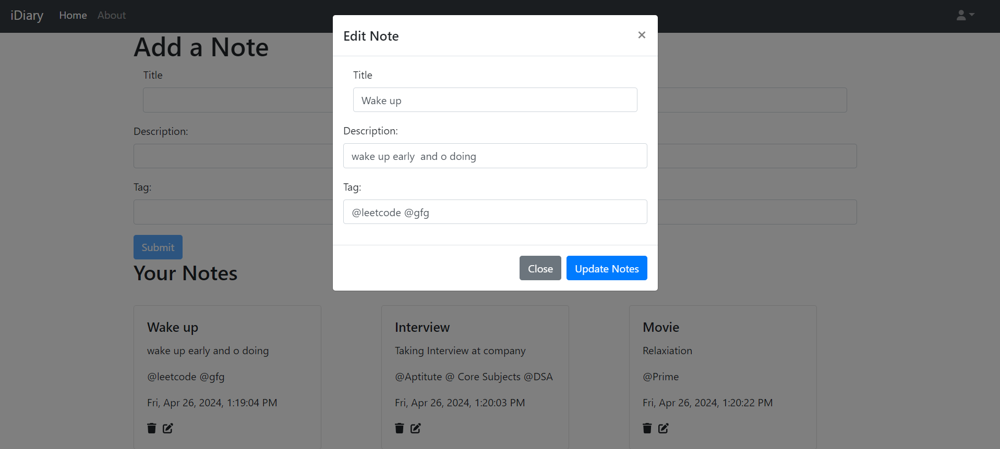

<h2>This is the iDiary Application built with the MERN Stack</h2>

👉

This is the where you can keep track your daily activities and daily tasks 

👉<h3>Technologies</h3>
FrontEnd: `React Js` `BootStrap` `JavaScript` `CSS`
Backend:`MongoDB` `ExpressJs` `Node Js`

<h3>Challenges</h3>
1.Implemented JWT authentication: Whenever a user creates a new account, a token will be generated and saved in MongoDB.
Implement real-time updates for tasks: Enable real-time updates for tasks to reflect changes made by users instantly across all devices.
2.Enhance security measures: Implement additional security measures such as input validation, verification,encryption of sensitive data, and protection against common web vulnerabilities like XSS and CSRF.
3.Made simple UI fo user a better Experience with responsive design

#

- **Login Page:**
  
  - If a user already has an account in iDiary and enters correct credentials matching the token in the database, they will be redirected to the Home page.
  - Once a user logs out from iDiary, the generated token will be deleted from the localStorage, and the user can't be redirected to the Home page. To continue, the user needs to follow the steps mentioned above.

- **Home Page:**
  
  - This is the Home page where users can add `Title`, `Description`, `Tags` in their respective iDiary entries, also indicating the Date.

- **Update Page:**
  
  - Users can edit their own iDiary tasks. Changes will be reflected with the newly updated date.

## Security Measures

Enhance security measures by implementing additional security features such as input validation, verification, encryption of sensitive data, and protection against common web vulnerabilities like XSS and CSRF.

## Setting Up Frontend

Don't forget to also clone the frontend repository available in your repositories.

After successful installations, please run the command `npm start` in `App.js` (frontend).

The application will start running at [http://localhost:3000](http://localhost:3000).
